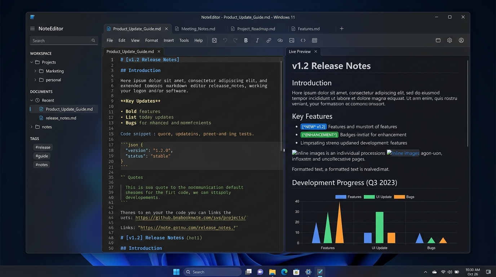

# NoteEditor - Modern Note & Markdown Editor for Windows

<div align="center">
  
  <h3>Fast, Clean & Distraction-Free Markdown Editor</h3>
  <p>Native Windows performance • Zero telemetry • Dual-pane markdown preview • 100% Free</p>
</div>

---

## 📸 Preview



---

## ✨ Features

- ⚡ **Blazing Native Speed**: Ultra-low memory footprint (<80 MB active RAM) and sub-second startup.
- 📝 **Live Dual-Pane Markdown**: Real-time synchronized preview with syntax highlighting for 50+ languages.
- 🔒 **100% Private & Local-First**: Notes remain stored on your PC as standard `.md` or `.txt` files.
- 🎨 **Modern Dark Aesthetics**: Custom themes crafted for Windows 10 & 11.
- 💬 **Community Reviews & Ratings**: Built-in reviews, star ratings, and community feedback.
- 🪶 **Lightweight**: Installer size of just 40 MB.

---

## 🚀 Hosting with GitHub Pages

This repository is ready to be hosted directly on **GitHub Pages**:

1. Create a new repository on GitHub (e.g. `noteeditor-web` or `NoteEditor`).
2. Push this repository:
   ```bash
   git init
   git add .
   git commit -m "Initial release of NoteEditor website"
   git branch -M main
   git remote add origin https://github.com/<YOUR_USERNAME>/<YOUR_REPO>.git
   git push -u origin main
   ```
3. In your GitHub repository:
   - Go to **Settings** → **Pages**.
   - Under **Build and deployment** > **Source**, choose **Deploy from a branch**.
   - Select branch: `main` and folder: `/ (root)`.
   - Click **Save**.
4. Your website will be live in minutes at: `https://<YOUR_USERNAME>.github.io/<YOUR_REPO>/`

---

## 💻 Local Preview

Run the built-in lightweight server:
```bash
node server.js
```
Then navigate to `http://localhost:3000/`.
