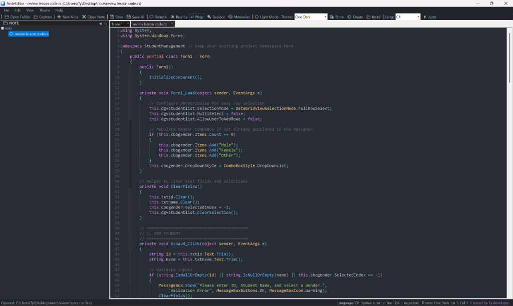

# NoteEditor - កម្មវិធីកត់ត្រា និងកែសម្រួល Markdown សម្រាប់ Windows

<div align="center">
  
  <h3>កម្មវិធីកត់ត្រា និងកែសម្រួល Markdown ដ៏លឿន និងស្អាត ឥតគិតថ្លៃ ១០០%</h3>
  <p>ដំណើរការលើ Windows ផ្ទាល់ • គ្មានការតាមដានទិន្នន័យ • ផ្ទាំងភ្លោះ Markdown មើលផ្ទាល់ • គាំទ្រភាសាខ្មែរ</p>
</div>

---

## 📸 រូបភាពគំរូ (Preview)



---

## ✨ លក្ខណៈពិសេសចម្បងៗ (Key Features)

- ⚡ **ល្បឿនលឿនមិនរអាក់រអួល (Blazing Native Speed)**: ប្រើប្រាស់ RAM តិចបំផុត (ក្រោម 80 MB) និងបើកដំណើរការភ្លាមៗ។
- 📝 **ផ្ទាំងភ្លោះ Markdown មើលផ្ទាល់ (Live Dual-Pane)**: បង្ហាញលទ្ធផលស្របគ្នាភ្លាមៗជាមួយ Syntax Highlighting ជាង ៥០ ភាសា។
- 🔒 **សុវត្ថិភាព និងឯកជនភាព ១០០% (Local-First)**: ឯកសាររក្សាទុកនៅលើកុំព្យូទ័ររបស់អ្នកជាទម្រង់ `.md` ឬ `.txt`។
- 🎨 **ផ្ទាំងពណ៌ងងឹត OLED ស្រាលភ្នែក (OLED Dark Mode)**: រចនាយ៉ាងទំនើបសម្រាប់ Windows 10 & 11។
- 💬 **ប្រព័ន្ធវាយតម្លៃ និងមតិយោបល់ (Community Reviews & Ratings)**: អាចដាក់ពិន្ទុផ្កាយ និងសរសេរមតិយោបល់ផ្ទាល់លើវេបសាយ។
- 🪶 **ទំហំតូចស្រាល (Lightweight Installer)**: កម្មវិធីដំឡើងទំហំត្រឹមតែ 40 MB ប៉ុណ្ណោះ។
- 🇰🇭 **គាំទ្រភាសាខ្មែរ (Khmer Language Support)**: ប្រើប្រាស់ពុម្ពអក្សរ Kantumruy Pro យ៉ាងស្រស់ស្អាត។

---

## 🚀 ការដាក់ដំណើរការលើ GitHub Pages (Hosting on GitHub Pages)

គម្រោងនេះត្រូវបានរៀបចំរួចរាល់សម្រាប់ដាក់ដំណើរការលើ **GitHub Pages**៖

1. បង្កើត Repository ថ្មីមួយនៅលើ GitHub (ឧទាហរណ៍៖ `noteeditor-web` ឬ `NoteEditor`) ដោយជ្រើសយក **Public**។
2. បញ្ជូនកូដទៅកាន់ GitHub (Push code):
   ```bash
   git add .
   git commit -m "គាំទ្រភាសាខ្មែរពេញលេញ (Khmer Language Support)"
   git branch -M main
   git remote add origin https://github.com/<YOUR_USERNAME>/<YOUR_REPO>.git
   git push -u origin main
   ```
3. នៅក្នុង GitHub Repository របស់អ្នក៖
   - ចូលទៅកាន់ **Settings** → **Pages**។
   - នៅក្រោម **Build and deployment** > **Source**, ជ្រើសរើស **Deploy from a branch**។
   - ជ្រើសរើស Branch: `main` និង Folder: `/ (root)`។
   - ចុច **Save**។
4. វេបសាយរបស់អ្នកនឹងដំណើរការផ្សាយផ្ទាល់ក្នុងរយៈពេល ១–២ នាទីនៅអាសយដ្ឋាន៖  
   🌐 `https://<YOUR_USERNAME>.github.io/<YOUR_REPO>/`

---

## 💻 សាកល្បងនៅលើកុំព្យូទ័រផ្ទាល់ (Local Preview)

បើកដំណើរការ Server មូលដ្ឋាន៖
```bash
node server.js
```
រួចបើក Browser ទៅកាន់អាសយដ្ឋាន `http://localhost:3000/`។

